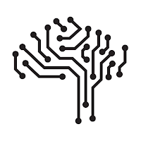
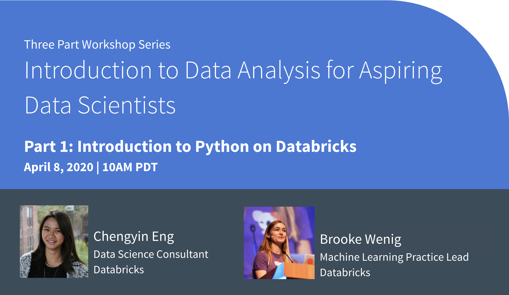
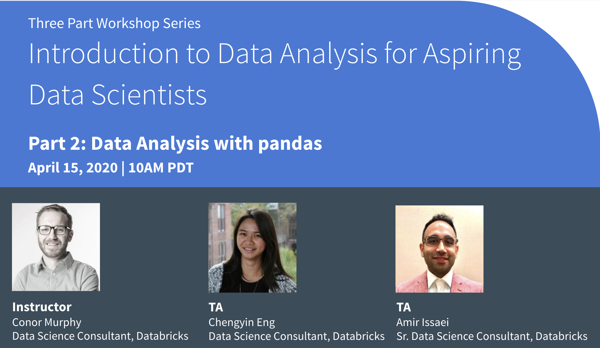
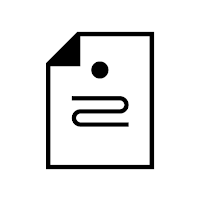
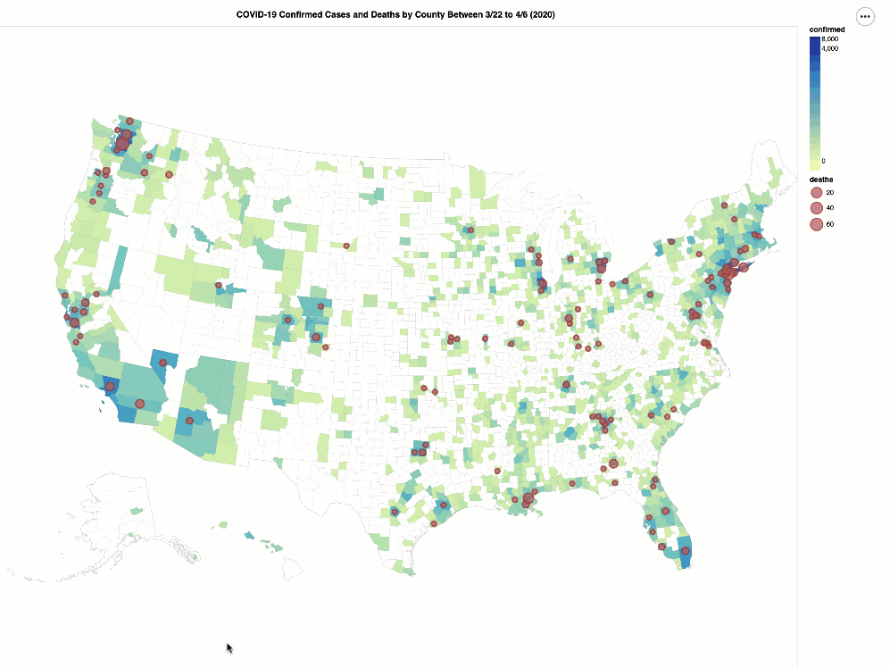

# tech-talks
This repository contains the notebooks and presentations we use for our Databricks Tech Talks.

You can find links to the tech talks below as well as the notebooks for these sessions directly in the repo. 

Sections
- [Featured Tech Talks](#Featured-Tech-Talks)
- [Upcoming Tech Talks](#Upcoming-Tech-Talks)
- [Featured Notebooks](#Featured-Notebooks)
- [Previous Tech Talks](#Previous-Tech-Talks)
- [COVID 19 Examples](#COVID-19-Samples)
  * [Datasets](#datasets)
  * [Notebooks](#notebooks)

<a name="Featured-Tech-Talks"/>
## Featured Tech Talks

####  2020-03-19 - [Analyzing COVID-19: Can the Data Community Help?](https://www.youtube.com/watch?v=A0uBdY4Crlg)

<blockquote>
With the current concerns over SARS-Cov-2 and COVID-19, there are now various COVID-19 datasets on Kaggle and GitHub, competitions such as the <a href="https://www.kaggle.com/allen-institute-for-ai/CORD-19-research-challenge" target="_blank">COVID-19 Open Research Dataset Challenge (CORD-19)</a>, and models such as University of Washington’s Institute for Health Metrics and Evaluation (IHME) <a href="https://covid19.healthdata.org/" target="_blank">COVID-19 Projections</a>. Whether you are a student or a professional data scientist, we thought we could help out by providing educational sessions on how to analyze these datasets.
</blockquote> 
 

####  2020-04-08 - [Workshop | Introduction to Data Analysis for Aspiring Data Scientists: Introduction to Python on Databricks](https://www.youtube.com/watch?v=HBVQAlv8MRQ)
<blockquote>
	 Python is a popular programming language because of its wide applications including but not limited to data analysis, machine learning, and web development. This workshop covers major foundational concepts necessary for you to start coding in Python, with a focus on data analysis. You will learn about different types of variables, for loops, functions, and conditional statements. No prior programming knowledge is required.
</blockquote> 
 

<a name="Upcoming-Tech-Talks"/>
## Upcoming-Tech-Talks

####  2020-04-15 - [Workshop | Introduction to Data Analysis for Aspiring Data Scientists: Data Analysis with Pandas](https://www.meetup.com/data-ai-online/events/269827433/)
<blockquote>
	 This workshop is on pandas, a powerful open-source Python package for data analysis and manipulation. In this workshop, you will learn how to read data, compute summary statistics, check data distributions, conduct basic data cleaning and transformation, and plot simple visualizations. We will be using data released by the <a href="https://github.com/CSSEGISandData/COVID-19" target="_blank">Johns Hopkins Center for Systems Science and Engineering (CSSE) Novel Coronavirus (COVID-19)</a>. Prior basic Python experience is recommended.
</blockquote> 
 

####  2020-04-16 - [Diving into Delta Lake: DML Internals](https://databricks.zoom.us/webinar/register/WN_loullvocQXSYfQye9mQNoA)
<blockquote>
	In the earlier Delta Lake Internals webinar series sessions, we described how the Delta Lake transaction log works. In this session, we will dive deeper into how commits, snapshot isolation, and partition and files change when performing deletes, updates, merges, and structured streaming.
</blockquote> 

####  2020-04-22 - [Workshop | Introduction to Data Analysis for Aspiring Data Scientists: Machine Learning with scikit-learn](https://www.meetup.com/data-ai-online/events/269838467/)  
<blockquote>
	scikit-learn is one of the most popular open-source machine learning libraries among data science practitioners. This workshop will walk through what machine learning is, the different types of machine learning, and how to build a simple machine learning model. This workshop focuses on the techniques of applying and evaluating machine learning methods, rather than the statistical concepts behind them. We will be using data released by the <a href="https://github.com/CSSEGISandData/COVID-19" target="_blank">Johns Hopkins Center for Systems Science and Engineering (CSSE) Novel Coronavirus (COVID-19)</a>. Prior basic Python experience is recommended.
</blockquote> 

<a name="Featured-Notebooks"/>
## Featured-Notebooks
####  [Notebook | Johns Hopkins CSSE COVID-19 Analysis](./samples/)  
<blockquote>
	This notebook processes and performs quick analysis from the 2019 Novel Coronavirus COVID-19 (2019-nCoV) Data Repository by Johns Hopkins CSSE (https://github.com/CSSEGISandData/COVID-19). The data is updated in the `/databricks-datasets/COVID/CSSEGISandData/` location regularly so you can access the data directly.  The following animated GIF shows the COVID-19 confirmed cases and deaths per the Johns Hopkins dataset spanning 15 days (March 22nd to April 6th 2020).
</blockquote> 
 

<a name="Previous-Tech-Talks"/>
## Previous-Tech-Talks

#### 2020-04-02 - [Diving into Delta Lake: Enforcing and Evolving Schema](https://www.youtube.com/watch?v=tjb10n5wVs8)
<blockquote>
	As business problems and requirements evolve over time, so too does the structure of your data. With Delta Lake, as the data changes, incorporating new dimensions is easy. Users have access to simple semantics to control the schema of their tables. These tools include schema enforcement, which prevents users from accidentally polluting their tables with mistakes or garbage data, as well as schema evolution, which enables them to automatically add new columns of rich data when those columns belong. In this webinar, we’ll dive into the use of these tools.
</blockquote> 

#### 2020-03-26 - [Diving into Delta Lake: Unpacking the Transaction Log](https://www.youtube.com/watch?v=F91G4RoA8is)
<blockquote>
	The transaction log is key to understanding Delta Lake because it is the common thread that runs through many of its most important features, including ACID transactions, scalable metadata handling, time travel, and more. In this session, we’ll explore what the Delta Lake transaction log is, how it works at the file level, and how it offers an elegant solution to the problem of multiple concurrent reads and writes.
</blockquote> 

####  2020-03-19 - [Machine Learning Lessons Learned from the Field: Interview with Brooke Wenig](https://www.meetup.com/data-ai-online/events/268966416/)
<blockquote>
	Developer Advocate Denny Lee will interview Brooke Wenig, Machine Learning Practice Lead, on the best practices and patterns when developing, training, and deploying Machine Learning algorithms in production.
</blockquote> 

####  2020-03-12 - [Simplify and Scale Data Engineering Pipelines with Delta Lake](https://www.youtube.com/watch?v=qtCxNSmTejk)
<blockquote>
	A common data engineering pipeline architecture uses tables that correspond to different quality levels, progressively adding structure to the data: data ingestion (“Bronze” tables), transformation/feature engineering (“Silver” tables), and machine learning training or prediction (“Gold” tables).  Combined, we refer to these tables as a “multi-hop” architecture. It allows data engineers to build a pipeline that begins with raw data as a “single source of truth” from which everything flows. In this session, we will show how to build a scalable data engineering data pipeline using Delta Lake. 
</blockquote> 

####  2020-03-05 - [Beyond Lambda: Introducing Delta Architecture](https://www.youtube.com/watch?v=FePv0lro0z8)
<blockquote>
	Lambda architecture is a popular technique where records are processed by a batch system and streaming system in parallel. With the advent of Delta Lake, we are seeing a lot of our customers adopting a simple continuous data flow model to process data as it arrives. We call this architecture, The Delta Architecture. In this session, we cover the major bottlenecks for adopting a continuous data flow model and how the Delta architecture solves those problems.
</blockquote> 

####  2020-02-27 - [Getting Data Ready for Data Science with Delta Lake and MLflow](https://www.youtube.com/watch?v=hQaENo78za0)
<blockquote>
	One must take a holistic view of the entire data analytics realm when it comes to planning for data science initiatives. Data engineering is a key enabler of data science helping furnish reliable, quality data in a timely fashion. Delta Lake, an open-source storage layer that brings reliability to data lakes can help take your data reliability to the next level.
</blockquote> 

####  2020-02-19 - [The Genesis of Delta Lake - An Interview with Burak Yavuz](https://www.youtube.com/watch?v=F-5t3QCI96g)
<blockquote>
	New decade, new start! Let's kick off 2020 with our first online meetup of the year featuring Burak Yavuz, Software Engineer at Databricks, for a talk about the genesis of Delta Lake. Developer Advocate Denny Lee will interview Burak Yavuz to learn about the Delta Lake team's decision making process and why they designed, architected, and implemented the architecture that it is today. Understand technical challenges that the team faced, how those challenges were solved, and learn about the plans for the future.
</blockquote> 

<a name="COVID-19-Samples"/>
## COVID-19-Samples
